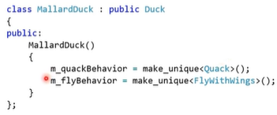

# 1. Отношения между классами и паттерн Стратегия
Диаграмма классов - показывает классы(и итерфейсы), их состав и отношения между ними
UML - универсальный язык моделирования

+ публичный метод -- +
+ приватный метод -- -
+ защищенный метод -- #
+ статический -- _
+ абстрактный -- *курсивом*

## Отношения между классами
У интерфейсов все методы пишутся курсивом
#### Композиция
- 1 объект - часть другого(составного)
- Часть в 1 момент времени принадлежит только 1 составному объекту
- Составной объект управляет своими частями
    - Часть удаляется при удалении составного объекта
- Часть не знает о том, в состав какого объекта она входит

*Пример: классы в С++ - точка на плоскости, окружность, многоугольник, класс комплексных чисел*

Обозначается стрелкой с ромбиком. Стрелка - со стороны части, ромбик - целого

#### Агрегация
похожа на композицию, но при агрегации совместное владение объектом(объект не владеет другим объектом, а лишь использует его)
- Разрушение 1 объекта не приводит к разрушению другого
- 1 объект делегирует часть работы другому объекту

*Пример: таксопарк и Яндекс с Убером. Если исчезнет Яндекс или Убер, таксопарк продолжит свое существование*

#### Зависимость
- отношение "Клиент - Поставщик"
- поставщик не знает про клиента
- кратковременный метод связи, существует лишь на время вызова метода клиента

*Пример: отрисовка фигур. Метод Draw, который принимал в себя холст*

Пунктирная стрелка (иногда с надписью use || return)

#### Наследование
- отношение "является" между классами
- создает новый класс не с 0, а на основе существующего класса
- новый класс сохраняет данные и поведение родительского класса
  

#### Реализация интерфейса (обозначение на диаграмме)
)
Только от класса к интерфейсу, между классами быть не может

## Паттерн "Стратегия"
Есть 2 вида уток: обычные и красноголовые.
Сделать отдельные класс? **Нет**, будет дублирование кода + плохая расширяемость

Используем наследование:

но вот новое требование - они должны летать. Просто добавим метод? Но стали летать и резиновые утки:

а такого быть не должно.
Но если добавят деревянных уток? Эти и не крякают, и не летают...

Решение: (плохое, дублирование кода, долгие проверки)

Хорошее решение:
1) отделить изменяемые части программы от неизменяемых. Все утки плавают и отрисовываются без проблем
2) Инкапсулировать изменяемые части, чтобы при изменении их не влиять на неизменяемые

*Программируйте, исходя из абстракций, а не реализаций*

Пример создания класса:

Паттерн определяет семейство алгоритмов, инкапсулирует каждый из них и обеспечивает их взаимозаменяемость. Он позволяет модифицировать алгоритмы независимо от их использования на стороне клиента.

Структура паттерна:
